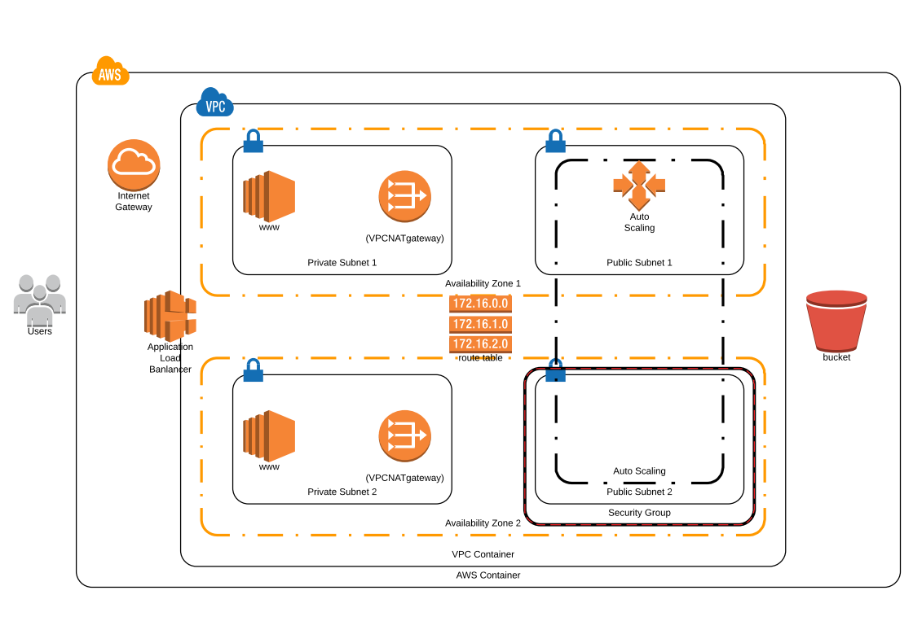

# Deploy a high-availability web app using CloudFormation.

## Summary
* [Introduction](#Introduction)
* [Project Description](#Project-Description)
* [Getting Started](#Getting-Started)
* [Application Deployment Diagram](#Application-Deployment-Diagram)
* [Prerequisites](#Prerequisites)
* [Running the tests](#Running-the-tests)
* [Built With](#Built-With)
* [Contributing](#Contributing)
* [Authors](#Authors)
* [License](#License)
* [Acknowledgments](#Acknowledgments)

## Introduction

In this project, we’ll deploy web servers for a highly available web app using CloudFormation.

It contains Cloudformation templates that will create and deploy the infrastructure and application for Instagram-like app from the ground up.

The deployment will be carried out in such a way that the networking components followed by servers, security roles and software are deployed in that order.

## Project Description

Udaphotoshare is creating an Instagram clone called Udagram. Developers pushed the latest version of their code in a zip file located in a public S3 Bucket.

The project is to deploying the application, along with the necessary supporting software into its matching infrastructure.

This needs to be done in an automated fashion so that the infrastructure can be discarded as soon as the testing team finishes their tests and gathers their results.

### Getting Started
#### Run aws cloudformation scripts below

###### From the project root folder run:
Network Deployment: aws cloudformation create-stack --stack-name iacUdacitynetwork --template-body file://Network.yml --parameters file://network-parameters.json

Servers Deployment: aws cloudformation create-stack --stack-name iacUdacityServers --template-body file://Servers.yml --parameters file://Servers-parameters.json --capabilities CAPABILITY_IAM

Run the script from terminal(Windows, Linux ou Mac) with AWS client application installed and configured connect and run cloudformation scripts on AWS.

### Application Deployment Diagram
  
  
### Prerequisites

AWS accout provisioned with, S3 bucket,  and IAM role with admin level access to connect a AWS. 

### Running the tests
Test by using the aws console to verify if the stack were created as expected.

### Built With

* [AWS](https://aws.amazon.com/) - Amazon Web Services.
* [Lucidchart](https://www.lucidchart.com/pages/?noHomepageRedirect=true) - Diagrams done right.

### Contributing
* **Teofilo Carlos Chichume ** 

### Authors

* **Teofilo Carlos Chichume** - *Initial work* - [nhatofo](https://github.com/nhatofo/udacity-cloud-devops.git)

### License

This project is licensed under the MIT License - see the [LICENSE.md](LICENSE.md) file for details

### Acknowledgments

* Inspiration [AWS Documentation](https://docs.aws.amazon.com/redshift/latest/dg/r_CREATE_TABLE_NEW.html),
[PurpleBooth](https://gist.github.com/PurpleBooth/109311bb0361f32d87a2)

